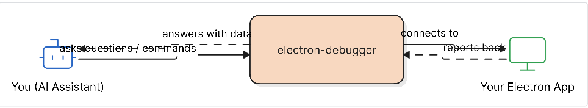
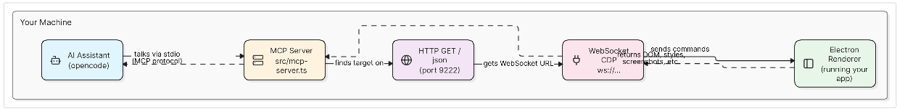

# @oussamaexe/electron-debugger

**Status: v3.0.0** — Verfügbar auf npm als `@oussamaexe/electron-debugger`.

MCP-Server zum Debuggen von Electron-Apps über das Chrome DevTools Protocol (CDP).

## Voraussetzungen

Deine Electron-App muss mit Remote-Debugging laufen:

```bash
/pfad/zu/deiner-electron-app --remote-debugging-port=9222
```

## Installation

```bash
npm install -g @oussamaexe/electron-debugger
```

Oder direkt ausführen:

```bash
npx @oussamaexe/electron-debugger mcp
```

## Konfiguration

| Variable | Standard | Beschreibung |
|---|---|---|
| `ELECTRON_DEBUG_PORT` | `9222` | CDP-Debugging-Port |
| `ELECTRON_DEBUG_HOST` | `127.0.0.1` | Host-Adresse fürs Debugging |

## Verwendung

### MCP-Server

```bash
electron-debugger mcp
```

Für opencode in die `opencode.json` einfügen:

```json
{
  "mcpServers": {
    "electron-debugger": {
      "command": "npx",
      "args": ["@oussamaexe/electron-debugger", "mcp"]
    }
  }
}
```

### CLI

```bash
electron-debugger exec get-dom-snapshot depth=3
electron-debugger exec click-element selector=button.submit
electron-debugger exec take-screenshot format=png
```

## Verfügbare Werkzeuge

| Tool | Beschreibung |
|---|---|
| `get-dom-snapshot` | DOM-Baum als Schnappschuss anzeigen |
| `get-element-box` | Position und Größe eines Elements ermitteln |
| `get-element-styles` | Berechnete CSS-Styles abrufen |
| `take-screenshot` | Bildschirmfoto der Seite oder eines Elements |
| `get-console-logs` | Konsolenausgaben abrufen |
| `get-metrics` | Leistungsdaten abfragen (FPS, Speicher, DOM-Knoten) |
| `click-element` | Ein Element per CSS-Selektor anklicken |
| `type-text` | Text in ein Eingabefeld schreiben |
| `highlight-element` | Ein Element farblich hervorheben |
| `list-windows` | Alle offenen Browser-Fenster auflisten |

## 1. Das große Ganze — Was dieses Tool macht



## 2. Wie die Verbindung läuft — Die Technik dahinter



## Wie es funktioniert

1. Die Electron-App stellt einen CDP-WebSocket über `--remote-debugging-port` bereit
2. `electron-debugger` findet alle Seiten unter `http://127.0.0.1:9222/json`
3. Stellt eine WebSocket-Verbindung zum ersten `page`-Ziel her
4. Die Werkzeuge kommunizieren über Chrome DevTools Protocol-Befehle
5. Der MCP-Server macht diese als Werkzeuge für KI-Assistenten verfügbar

## Entwicklung

```bash
git clone https://github.com/oussamaexe/electron-debugger.git
cd electron-debugger
npm install
npm run build
npm test
```

## Lizenz

MIT
